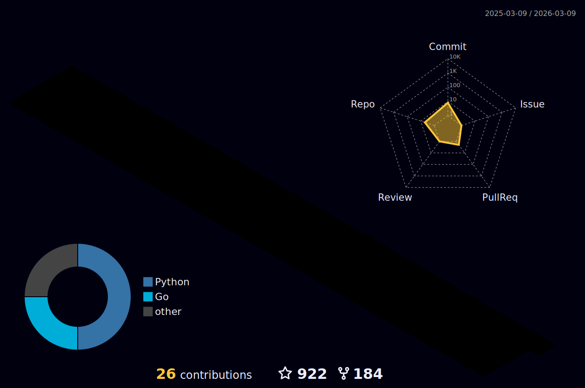

# Hey!
<h4>$ whoami</h4>

  <samp>
    🧭 DevOps/Security Engineer  
    :house_with_garden: Currently based in India 🇮🇳  
    :school: CSE VCET(MU) [2025]  
    :email:	<a href="mailto:prbh47kumr@gmail.com
">prbh47kumr@gmail.com</a>  
    :briefcase: LinkedIn:  <a href="https://www.linkedin.com/in/prabhatrahi/">Prabhat Rahi</a>  
    :bird: Twitter:  <a href="https://twitter.com/prbhtkumr">prbhtkumr</a>  
    :cloud: TryHackMe: <a href="https://tryhackme.com/p/Cthulhu/">Cthulhu</a>  
  </samp>

  
  
  
  
  
  
  

<kbd>some info</kbd>

<h4>currently learning </h4>

    
    
    
    
    

<kbd>more info</kbd>

---------
 

