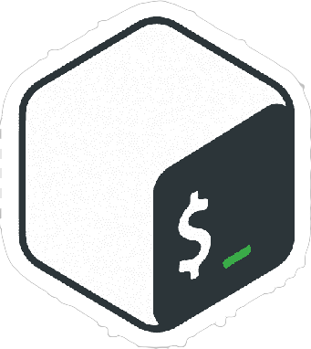
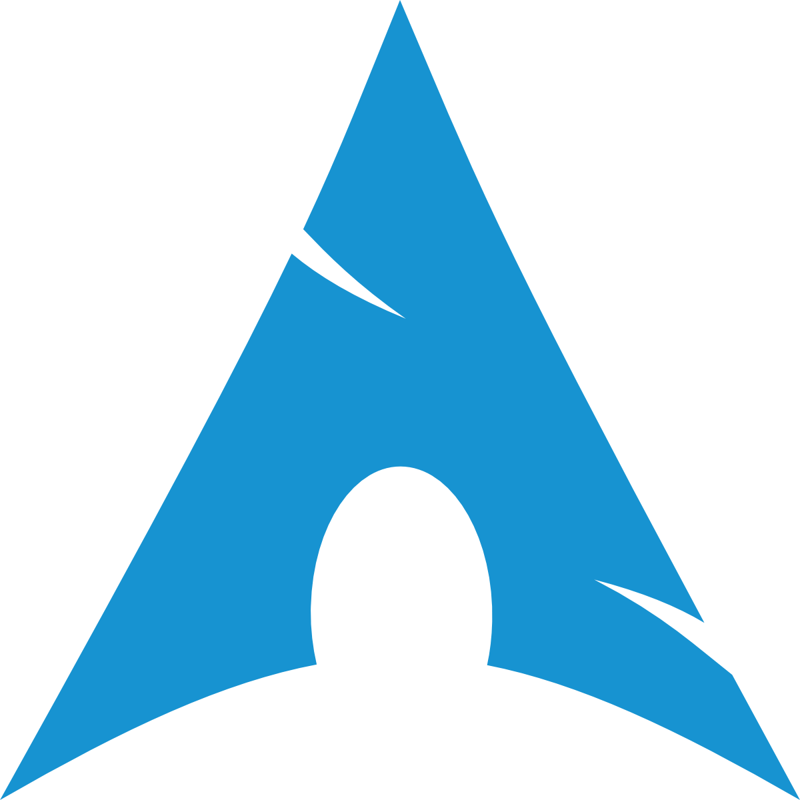
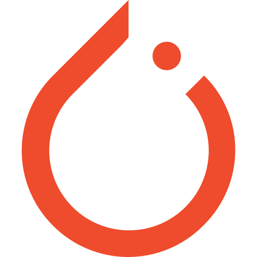

# Hey!
<h4>$ whoami</h4>

  <samp>
    🧭 DevOps/Security Engineer  
    :house_with_garden: Currently based in Mumbai 🇮🇳  
    :school: CSE VCET(MU) [2027]  
    :email:	<a href="mailto:hi@prbhtkumr.xyz
">hi@prbhtkumr.xyz</a>  
    :briefcase: <a href="https://www.linkedin.com/in/prbhtkumr/">LinkedIn</a>  
    :bird: <a href="https://twitter.com/prbhtkumr">Twitter</a>  
  </samp>

  
  
  
  
  
  
  

<kbd>some info</kbd>

<h4>currently learning </h4>

    
    
    
    
    
    

 
<kbd>more ?</kbd>

 

  

---------
 

