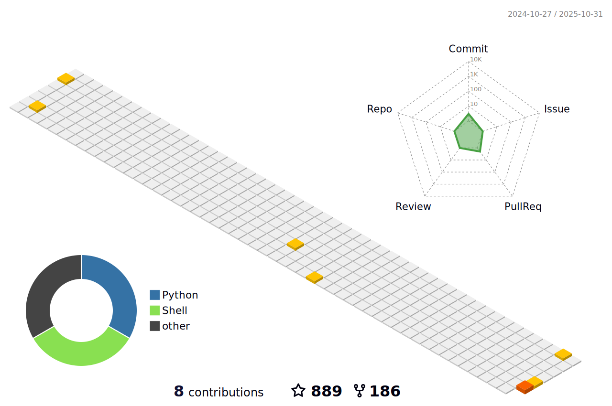

<<<<<<< HEAD
<h1>Hey.</h1>

 
<h4>$ whoami</h4>

  <samp>
    🧭 Devops Engineer / Security  
    :house_with_garden: Currently based in India 🇮🇳  
    :school: CSE VCET(MU) [2025]  
    :email:	<a href="mailto:prbh47kumr@gmail.com
">prbh47kumr@gmail.com</a>  
    :briefcase: LinkedIn:  <a href="https://www.linkedin.com/in/prbhtkumar/">Prabhat Kumar</a>  
    :bird: Twitter:  <a href="https://twitter.com/a3r0s0l_can">a3r0s0l_can</a>  
    :cloud: TryHackMe: <a href="https://tryhackme.com/p/Cthulhu/">Cthulhu</a>  
    </samp>

<kbd>some info</kbd>

<h4>currently learning </h4>

    
    
    
    
    

<kbd>more info</kbd>

---------
 

=======

Welcome to my profile!
========================

---------

## About me

        

#### I am Prabhat Kumar. I am a CSE Fresher from India. I also am a Python Developer actively looking to Contribute . I am currently working on my Data Structure and Algorithm Skills. I am a Cyber Security Enthusiast who likes playing CTFs. I am looking forward to certify as an OSCP.

---------

<h3 align="left">Languages and Tools:</h3>

 </a>      

---------

---------

>>>>>>> 5a35e37f03d891f2517997889bb89321cffdfc5b
